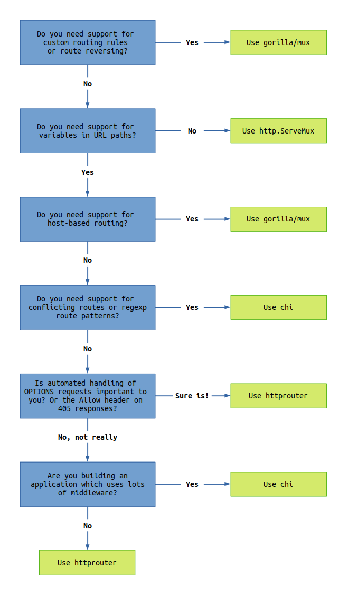

# Выбор роутера для курсового проекта

Следуя [1] определимся с проблемой выбора. 

## Определения основных терминов 
**Routing** означает управление маршрутизацией

**URL router** - это приложение для сортировки процессов на основе URL

**Префиксное дерево** - это тип древовидной структуры, которая обрабатывает набор строк.
> Вычислительная сложность префиксного дерева одинакова для поиска и вставки, а когда длина ключа поиска равна m, наихудшая вычислительная сложность составляет O(n).

**Параметры пути** - это то, что обычно следует после знака **?**. 
> Параметры разделены знаком **&**. Обычно параметр представляет пару <ключ> <значение>. Например: **?user=vasya&age=25** 

## Что делает router (маршрутизатор)
Router получает часть пути URL в качестве входных данных, определяет данные, которые соответствуют пути, и вызывает процесс.

Базовая реализация, которая сопоставляет путь и процесс, реализует алгоритм, используя структуру данных, называемую древовидной структурой.

Древовидная структура - это структура данных, которая имеет корни, ветви, узлы и листья (узлы в конце листа).

Для поиска IP-адресов на сетевом уровне, используют префиксное дерево, маршрутизации http на прикладном уровне и морфологического анализа в контексте машинного обучения.

## Почему стандартный router может не подойти? И что с этим делать? 

Cтандартный пакет (http.NewServeMux) не поддерживает параметры пути, поэтому если вы хотите использовать его, вам необходимо подготовить внешний пакет или расширить стандартный multiplexe

В [2] приводится подробный анализ популярных маршрутизаторов и предлагается алгоритм подбора маршрутизатора.

Поскольку в нашем приложении может потребоваться (в самом сложном варианте) авторизация, регистрация и переход в личный кабинет. 

Следуя этому алгоритму можно утверждать, что с большим запасом нас удовлетворит **chi**. Но может оказаться, что и стандартный роутер нас устроит. 

Окончательный вывод будет сделан в процессе реализации. На первом этапе будем использовать роутер из коробки и по мере продвижения возможно применим chi.

## Источники

1) [Introduction to URL router from scratch with Golang](https://dev.to/bmf_san/introduction-to-url-router-from-scratch-with-golang-3p8j)
2) [Which Go router should I use? (with flowchart)](https://www.alexedwards.net/blog/which-go-router-should-i-use)