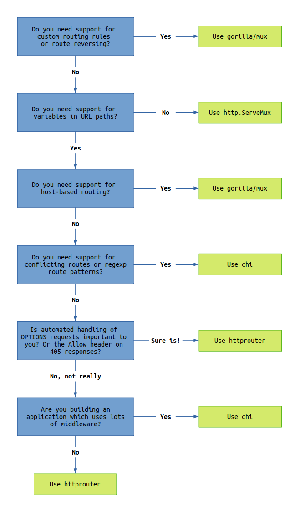

# Практическое задание:

1. Выбрать роутер для курсового проекта. Приложить ссылки на код или Pull Request. Добавить в
   README проекта обоснование выбора роутера

# Выбор роутера

Ниже приведены выдержки взтые из различных источников (обычно это README.md репозиториев с исходниками роутеров)

## FIBER

### Limitations

- Due to Fiber's usage of unsafe, the library may not always be compatible with the latest Go version. Fiber 2.29.0 has been tested with Go versions 1.14 to 1.19.
- Fiber is not compatible with net/http interfaces. This means you will not be able to use projects like gqlgen, go-swagger, or any others which are part of the net/http ecosystem.

## BunRouter

<table>
<thead>
<tr>
<th>Router</th>
<th>Middlewares</th>
<th>Error handling</th>
<th>Routes priority</th>
<th>net/http API</th>
</tr>
</thead>
<tbody>
<tr>
<td>BunRouter</td>
<td><g-emoji class="g-emoji" alias="heavy_check_mark" fallback-src="https://github.githubassets.com/images/icons/emoji/unicode/2714.png">✔️</g-emoji></td>
<td><g-emoji class="g-emoji" alias="heavy_check_mark" fallback-src="https://github.githubassets.com/images/icons/emoji/unicode/2714.png">✔️</g-emoji></td>
<td><g-emoji class="g-emoji" alias="heavy_check_mark" fallback-src="https://github.githubassets.com/images/icons/emoji/unicode/2714.png">✔️</g-emoji></td>
<td><g-emoji class="g-emoji" alias="heavy_check_mark" fallback-src="https://github.githubassets.com/images/icons/emoji/unicode/2714.png">✔️</g-emoji></td>
</tr>
<tr>
<td><a href="https://github.com/julienschmidt/httprouter">httprouter</a></td>
<td><g-emoji class="g-emoji" alias="x" fallback-src="https://github.githubassets.com/images/icons/emoji/unicode/274c.png">❌</g-emoji></td>
<td><g-emoji class="g-emoji" alias="x" fallback-src="https://github.githubassets.com/images/icons/emoji/unicode/274c.png">❌</g-emoji></td>
<td><g-emoji class="g-emoji" alias="x" fallback-src="https://github.githubassets.com/images/icons/emoji/unicode/274c.png">❌</g-emoji></td>
<td><g-emoji class="g-emoji" alias="heavy_check_mark" fallback-src="https://github.githubassets.com/images/icons/emoji/unicode/2714.png">✔️</g-emoji></td>
</tr>
<tr>
<td><a href="https://github.com/go-chi/chi">Chi</a></td>
<td><g-emoji class="g-emoji" alias="heavy_check_mark" fallback-src="https://github.githubassets.com/images/icons/emoji/unicode/2714.png">✔️</g-emoji></td>
<td><g-emoji class="g-emoji" alias="x" fallback-src="https://github.githubassets.com/images/icons/emoji/unicode/274c.png">❌</g-emoji></td>
<td><g-emoji class="g-emoji" alias="heavy_check_mark" fallback-src="https://github.githubassets.com/images/icons/emoji/unicode/2714.png">✔️</g-emoji></td>
<td><g-emoji class="g-emoji" alias="heavy_check_mark" fallback-src="https://github.githubassets.com/images/icons/emoji/unicode/2714.png">✔️</g-emoji></td>
</tr>
<tr>
<td><a href="https://github.com/labstack/echo">Echo</a></td>
<td><g-emoji class="g-emoji" alias="heavy_check_mark" fallback-src="https://github.githubassets.com/images/icons/emoji/unicode/2714.png">✔️</g-emoji></td>
<td><g-emoji class="g-emoji" alias="heavy_check_mark" fallback-src="https://github.githubassets.com/images/icons/emoji/unicode/2714.png">✔️</g-emoji></td>
<td><g-emoji class="g-emoji" alias="x" fallback-src="https://github.githubassets.com/images/icons/emoji/unicode/274c.png">❌</g-emoji></td>
<td><g-emoji class="g-emoji" alias="x" fallback-src="https://github.githubassets.com/images/icons/emoji/unicode/274c.png">❌</g-emoji></td>
</tr>
<tr>
<td><a href="https://github.com/go-gin/gin">Gin</a></td>
<td><g-emoji class="g-emoji" alias="heavy_check_mark" fallback-src="https://github.githubassets.com/images/icons/emoji/unicode/2714.png">✔️</g-emoji></td>
<td><g-emoji class="g-emoji" alias="heavy_check_mark" fallback-src="https://github.githubassets.com/images/icons/emoji/unicode/2714.png">✔️</g-emoji></td>
<td><g-emoji class="g-emoji" alias="x" fallback-src="https://github.githubassets.com/images/icons/emoji/unicode/274c.png">❌</g-emoji></td>
<td><g-emoji class="g-emoji" alias="x" fallback-src="https://github.githubassets.com/images/icons/emoji/unicode/274c.png">❌</g-emoji></td>
</tr>
</tbody>
</table>

## Echo

<table>
<thead>
<tr>
<th>Repository</th>
<th>Description</th>
</tr>
</thead>
<tbody>
<tr>
<td><a href="https://github.com/labstack/echo-contrib">github.com/labstack/echo-contrib</a></td>
<td>(by Echo team) <a href="https://github.com/casbin/casbin">casbin</a>, <a href="https://github.com/gorilla/sessions">gorilla/sessions</a>, <a href="/labstack/echo/blob/master/github.com/uber/jaeger-client-go">jaegertracing</a>, <a href="https://github.com/prometheus/client_golang/">prometheus</a>, <a href="https://pkg.go.dev/net/http/pprof" rel="nofollow">pprof</a>, <a href="https://github.com/openzipkin/zipkin-go">zipkin</a> middlewares</td>
</tr>
<tr>
<td><a href="https://github.com/deepmap/oapi-codegen">deepmap/oapi-codegen</a></td>
<td>Automatically generate RESTful API documentation with <a href="https://swagger.io/specification/" rel="nofollow">OpenAPI</a> Client and Server Code Generator</td>
</tr>
<tr>
<td><a href="https://github.com/swaggo/echo-swagger">github.com/swaggo/echo-swagger</a></td>
<td>Automatically generate RESTful API documentation with <a href="https://swagger.io/" rel="nofollow">Swagger</a> 2.0.</td>
</tr>
<tr>
<td><a href="https://github.com/ziflex/lecho">github.com/ziflex/lecho</a></td>
<td><a href="https://github.com/rs/zerolog">Zerolog</a> logging library wrapper for Echo logger interface.</td>
</tr>
<tr>
<td><a href="https://github.com/brpaz/echozap">github.com/brpaz/echozap</a></td>
<td>Uber´s <a href="https://github.com/uber-go/zap">Zap</a> logging library wrapper for Echo logger interface.</td>
</tr>
<tr>
<td><a href="https://github.com/darkweak/souin/tree/master/plugins/echo">github.com/darkweak/souin/plugins/echo</a></td>
<td>HTTP cache system based on <a href="https://github.com/darkweak/souin">Souin</a> to automatically get your endpoints cached. It supports some distributed and non-distributed storage systems depending your needs.</td>
</tr>
<tr>
<td><a href="https://github.com/mikestefanello/pagoda">github.com/mikestefanello/pagoda</a></td>
<td>Rapid, easy full-stack web development starter kit built with Echo.</td>
</tr>
<tr>
<td><a href="https://github.com/go-woo/protoc-gen-echo">github.com/go-woo/protoc-gen-echo</a></td>
<td>ProtoBuf generate Echo server side code</td>
</tr>
</tbody>
</table>

## julienschmidt/httprouter

### Web Frameworks based on HttpRouter

<ul dir="auto">
<li><a href="https://github.com/plimble/ace">Ace</a>: Blazing fast Go Web Framework</li>
<li><a href="https://github.com/manyminds/api2go">api2go</a>: A JSON API Implementation for Go</li>
<li><a href="https://github.com/gin-gonic/gin">Gin</a>: Features a martini-like API with much better performance</li>
<li><a href="https://github.com/bahlo/goat">Goat</a>: A minimalistic REST API server in Go</li>
<li><a href="https://github.com/TobiEiss/goMiddlewareChain">goMiddlewareChain</a>: An express.js-like-middleware-chain</li>
<li><a href="https://github.com/najeira/hikaru">Hikaru</a>: Supports standalone and Google AppEngine</li>
<li><a href="https://github.com/nbio/hitch">Hitch</a>: Hitch ties httprouter, <a href="https://github.com/nbio/httpcontext">httpcontext</a>, and middleware up in a bow</li>
<li><a href="https://github.com/corneldamian/httpway">httpway</a>: Simple middleware extension with context for httprouter and a server with gracefully shutdown support</li>
<li><a href="https://github.com/guregu/kami">kami</a>: A tiny web framework using x/net/context</li>
<li><a href="https://github.com/imdario/medeina">Medeina</a>: Inspired by Ruby's Roda and Cuba</li>
<li><a href="https://github.com/rocwong/neko">Neko</a>: A lightweight web application framework for Golang</li>
<li><a href="https://github.com/chai2010/pbgo">pbgo</a>: pbgo is a mini RPC/REST framework based on Protobuf</li>
<li><a href="https://github.com/abiosoft/river">River</a>: River is a simple and lightweight REST server</li>
<li><a href="https://github.com/VividCortex/siesta">siesta</a>: Composable HTTP handlers with contexts</li>
<li><a href="https://github.com/rs/xmux">xmux</a>: xmux is a httprouter fork on top of xhandler (net/context aware)</li>
</ul>

## Какой роутер выбрать?

Вот табличка из статьи [Which Go router should I use?](https://www.alexedwards.net/blog/which-go-router-should-i-use)

[from]

<table id="routers">
    <thead>
        <tr>
            <th>Repository</th>
            <th>Notes</th>
        </tr>
    </thead>
    <tbody>
        <tr>
            <td><a href="https://github.com/celrenheit/lion">celrenheit/lion</a></td>
            <td>Currently unmaintained.</td>
        </tr>
        <tr>
            <td><a href="https://github.com/claygod/Bxog">claygod/Bxog</a></td>
            <td>Currently unmaintained.</td>
        </tr>
        <tr>
            <td><a href="https://github.com/clevergo/clevergo">clevergo/clevergo</a></td>
            <td>Uses custom handler signature (not http.Handler or http.HandlerFunc).</td>
        </tr>
        <tr>
            <td><a href="https://github.com/dimfeld/httptreemux">dimfeld/httptreemux</a></td>
            <td>Doesn’t fully support http.Handler. Requires middleware for setting custom 404/405 handlers.</td>
        </tr>
        <tr>
            <td><a href="https://github.com/donutloop/mux">donutloop/mux</a></td>
            <td>Currently unmaintained.</td>
        </tr>
        <tr>
            <td><a href="https://github.com/gernest/alien">gernest/alien</a></td>
            <td>Currently unmaintained.</td>
        </tr>
        <tr>
            <td><a href="https://github.com/go-ozzo/ozzo-routing">go-ozzo/ozzo-routing</a></td>
            <td>Uses custom handler signature (not http.Handler or http.HandlerFunc).</td>
        </tr>
        <tr>
            <td><a href="https://github.com/go-playground/lars">go-playground/lars</a></td>
            <td>Currently unmaintained.</td>
        </tr>
        <tr>
            <td><a href="https://github.com/go-zoo/bone">go-zoo/bone</a></td>
            <td>Good, but has similar use case to chi (which offers more). Incomplete tests.</td>
        </tr>
        <tr>
            <td><a href="https://github.com/go101/tinyrouter">go101/tinyrouter</a></td>
            <td>Verbose route declarations. Doesn’t automatically send 405 responses.</td>
        </tr>
        <tr>
            <td><a href="https://github.com/gocraft/web">gocraft/web</a></td>
            <td>Currently unmaintained.</td>
        </tr>
        <tr>
            <td><a href="https://github.com/goji/goji">goji/goji</a></td>
            <td>Slightly unusual, but flexible, API which supports custom matchers. Requires middleware for setting
                custom 404/405 handlers. Good, but I think gorilla/mux offers similar features and is easier to use.
            </td>
        </tr>
        <tr>
            <td><a href="https://github.com/goroute/route">goroute/route</a></td>
            <td>Uses custom handler signature (not http.Handler or http.HandlerFunc).</td>
        </tr>
        <tr>
            <td><a href="https://github.com/gowww/router">gowww/router</a></td>
            <td>Good, but has similar use case to chi (which offers more). No way to set custom 405 handler.</td>
        </tr>
        <tr>
            <td><a href="https://github.com/GuilhermeCaruso/bellt">GuilhermeCaruso/bellt</a></td>
            <td>No way to set custom 404 or 405 handlers.</td>
        </tr>
        <tr>
            <td><a href="https://github.com/husobee/vestigo">husobee/vestigo</a></td>
            <td>Currently unmaintained. Only supports http.HandlerFunc.</td>
        </tr>
        <tr>
            <td><a href="https://github.com/naoina/denco">naoina/denco</a></td>
            <td>Currently unmaintained.</td>
        </tr>
        <tr>
            <td><a href="https://github.com/nbari/violetear">nbari/violetear</a></td>
            <td>Good, but has similar use case to chi (which offers more). Wraps http.ResponseWriter with own custom
                type, which may cause problems in some cases.</td>
        </tr>
        <tr>
            <td><a href="https://github.com/nbio/hitch">nbio/hitch</a></td>
            <td>Lacking documentation.</td>
        </tr>
        <tr>
            <td><a href="https://github.com/nissy/bon">nissy/bon</a></td>
            <td>Currently unmaintained.</td>
        </tr>
        <tr>
            <td><a href="https://github.com/razonyang/fastrouter">razonyang/fastrouter</a></td>
            <td>Currently unmaintained.</td>
        </tr>
        <tr>
            <td><a href="https://github.com/rs/xmux">rs/xmux</a></td>
            <td>Currently unmaintained. Uses custom handler signature (not http.Handler or http.HandlerFunc).</td>
        </tr>
        <tr>
            <td><a href="https://github.com/takama/router">takama/router</a></td>
            <td>Currently unmaintained.</td>
        </tr>
        <tr>
            <td><a href="https://github.com/vardius/gorouter">vardius/gorouter</a></td>
            <td>Good, but has similar use case to chi (which offers more). Four major versions in 5 years suggests the
                API may not be reliable.</td>
        </tr>
        <tr>
            <td><a href="https://github.com/VividCortex/siesta">VividCortex/siesta</a></td>
            <td>Good, but has similar use case to chi (which offers more). No way to set custom 405 handler.</td>
        </tr>
        <tr>
            <td><a href="https://github.com/xujiajun/gorouter">xujiajun/gorouter</a></td>
            <td>Currently unmaintained.</td>
        </tr>
    </tbody>
</table>

### Вывод приведенный в стать выглядит как графический алгоритм:

## Выводы приведенные в [go-http-routing-benchmark](https://github.com/julienschmidt/go-http-routing-benchmark)

Прежде всего, нет причин использовать стандартный ServeMux от net/http, который очень ограничен и не обладает особенно хорошей производительностью. Существует достаточно альтернатив на любой вкус, выбирайте ту, которая вам больше нравится.

Во-вторых, за широкий набор функций некоторых фреймворков приходится платить высокую цену в плане производительности. Например, Martini обладает большой гибкостью, но очень плохой производительностью. Martini имеет худшую производительность среди всех протестированных маршрутизаторов во многих бенчмарках. Beego, похоже, имеет некоторые проблемы с масштабируемостью и легко побеждает Martini с еще худшей производительностью, когда количество параметров или маршрутов велико. Я очень надеюсь, что маршрутизация этих пакетов может быть оптимизирована. Я думаю, что Go-экосистема нуждается в таких многофункциональных фреймворках, как эти.

И последнее, но не менее важное: мы должны определить чемпиона по производительности.

Denco и его предшественник Kocha-urlrouter, похоже, обладают большой производительностью, но их неудобно использовать в качестве маршрутизатора для пакета net/http. Для использования его в качестве http.Handler требуется много дополнительной работы. В README Denco утверждается, что пакет не предназначен для замены http.ServeMux.

Goji выглядит очень достойно. Он обладает отличной производительностью и в то же время большим набором функций, больше, чем любой другой маршрутизатор/фреймворк в группе лидеров.

В настоящее время ни один маршрутизатор не может превзойти производительность пакета HttpRouter, который в настоящее время доминирует почти во всех бенчмарках.

В конечном итоге, производительность не может быть (единственным) критерием для выбора маршрутизатора. Поиграйте немного с некоторыми маршрутизаторами и выберите тот, который вам больше нравится.

# Мой выбор

Проанализировав все вышеприведенное пришел к выводу что в пректе имеет смысл использовать либо стандартный роутер, либо chi.
